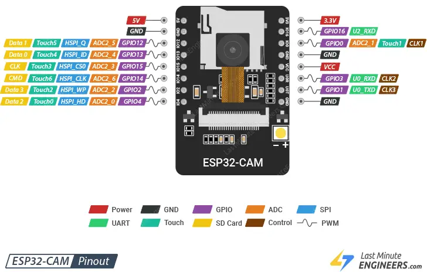
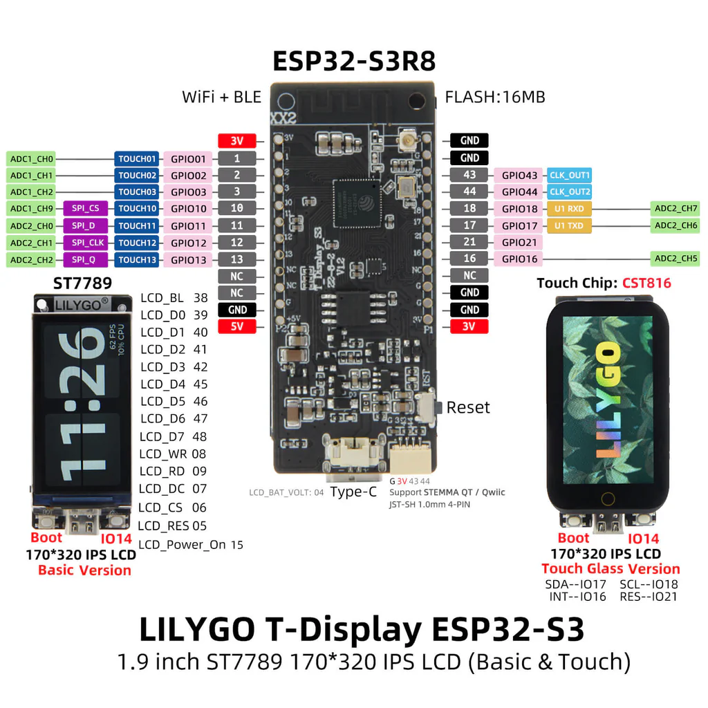

# EyeBot Assembly

## EyeBot Wiring Connections

| T-Display-S3 GPIO Pin | ESP32-CAM GPIO Pin |
|-----------------------|-----------------------|
| 43 | 14 |
| 44 | 2 |
| 1 | 3 |
| 2 | 1 |

| T-Display-S3 GPIO Pin | Makerverse 2 Channel Motor Driver Pin |
|-----------------------|-----------------|
| 3 | DIR B |
| 10 | PWM B |
| 11 | DIR A | 
| 12 | PWM A |

| T-Display-S3 GPIO Pin | Analog Distance Sensor |
|-----------------------|------------------------|
| 13 | Data Output |

## EyeBot Pinout Diagram


# EyeBot Software Library Installation

To install the EyeBot software library, either copy the entire folder this repo is contained in into the
Arduino libraries folder on your respective platform, or if this repo is entirely contained within a `.zip` file, install it by opening Arduino IDE and selecting the series of options from the toolbar menu `Sketch > Include Library > Add .ZIP Library`.

Similarly, the custom ```TFT_eSPI``` and ```TouchLib``` libraries found in the `libs` directory of this repo **must** also be installed within Arduino IDE by selecting the series of options from the toolbar menu `Sketch > Include Library > Add .ZIP Library`, and then selecting the `.zip` files found within the `libs` directory respectively.

# EyeBot Usage

## Upload the required EyeBot program to the ESP32-CAM

Open the `camera.ino` project found under the `camera` directory of this repo within Arduino IDE, set the board-type to `AI-Thinker ESP32-CAM` with the default settings under `Tools`, and then upload the program to the ESP32-CAM.

When new code is uploaded to the T-Display-S3 while both the T-Display-S3 and the ESP32-CAM are on-board the EyeBot, the image that the ESP32-CAM returns will most likely be visually split in two and out of sync. Powering the EyeBot off and on again should fix this.

### ESP32-CAM Pinout Diagram



### Mitigating Image Interference

To mitigate interference in images returned from the ESP32-CAM due to voltage drops created by the motors stalling or turning over from a stationary state, place a **16V, 220 uF capacitor** along the power rail connecting the ESP32-CAM to the T-Display-S3's 5V output pin, as depicted in the above pinout diagram for the EyeBot.

## Include ESP32 Boards within Arduino IDE

Select from the toolbar `File` and select the dropdown menu option `Preferences`.
In the field `Additional boards manager URLs`, add the URL `https://dl.espressif.com/dl/package_esp32_index.json`.

## Uploading a program to the T-Display-S3

Add...

```#include <eyebot.h>```

... to the top of your Arduino ```.ino``` sketch and set the board type as `ESP32S3 Dev Module`,
with the settings under the toolbar menu option `Tools` adjusted to:

| Arduino IDE Setting                  | Value                             |
| ------------------------------------ | --------------------------------- |
| Board                                | **ESP32S3 Dev Module**            |
| Port                                 | Your port                         |
| USB CDC On Boot                      | Enable                            |
| CPU Frequency                        | 240MHZ(WiFi)                      |
| Core Debug Level                     | None                              |
| USB DFU On Boot                      | Disable                           |
| Erase All Flash Before Sketch Upload | Disable                           |
| Events Run On                        | Core1                             |
| Flash Mode                           | QIO 80MHZ                         |
| Flash Size                           | **16MB(128Mb)**                   |
| Arduino Runs On                      | Core1                             |
| USB Firmware MSC On Boot             | Disable                           |
| Partition Scheme                     | **16M Flash(3M APP/9.9MB FATFS)** |
| PSRAM                                | **OPI PSRAM**                     |
| Upload Mode                          | **UART0/Hardware CDC**            |
| Upload Speed                         | 921600                            |
| USB Mode                             | **Hardware CDC and JTAG**                  |

Bold entries reflect options that are non-default.

`EYEBOTInit()` must be called before any other library functions declared in `eyebot.h` are called in the `setup()` function
of the `.ino` sketch.

### T-Display-S3 Pinout Diagram



# Example Programs

| Example name | Description |
| ------------ | ----------- |
| tests         | Tests specific features of the EyeBot, including the camera, driving functions, and position estimation. |
| color_nav | After sampling a pixel colour in the EyeBot's view, the EyeBot can drive towards the centre-point of the largest object in its view whose colour falls within the specified HSI threshold, all the while avoiding head-on collisions. |
| ultrafast_lane | A lane-based navigation demo that detects lanes using the ["Ultrafast" line detector](https://www.spiedigitallibrary.org/journals/journal-of-electronic-imaging/volume-31/issue-4/043019/Ultrafast-line-detector/10.1117/1.JEI.31.4.043019.short) method. Can navigate a complete lap of the UWA Robotics Lab test circuit by staying within the solid lane markings. |
| color_lane | Unfinished implementation of [Colour-based Segmentation for lane detection](https://ieeexplore.ieee.org/document/1505186). Currently shows a debug screen, and whether the algorithm can actually detect lanes has not yet been tested. |