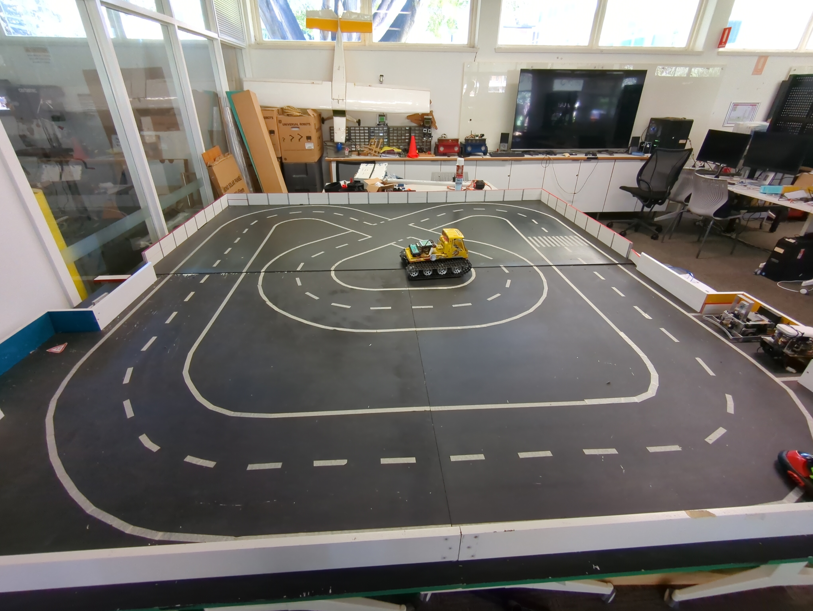

# "Ultrafast" Lane Navigation Program

This program is designed to navigate the EyeBot around the
UWA Robotics Lab's test circuit autonomously.

Lanes are detected in the view of its camera through line detection,
and the specific line detection algorithm being used is the [Ultrafast line detector](https://www.spiedigitallibrary.org/journals/journal-of-electronic-imaging/volume-31/issue-4/043019/Ultrafast-line-detector/10.1117/1.JEI.31.4.043019.short), authored by Baykal and Yilmaz.

## Usage

### Home Screen

On the *Home Screen*, the user can adjust the maximum linear and angular speed for the EyeBot. If the EyeBot determines
that the lanes on either side of it are not bending, it will drive
ahead according to this linear speed. If it does determine the lanes to be bending either to the left or right however, the linear speed will be retained alongside setting the angular speed to adjust the direction of the EyeBot gradually and accordingly. Pressing **TEST**
takes the user to the *Test Screen*, and pressing **START** takes the user to the *Navigation Screen*.

### Test Screen

On the *Test Screen*, the user is provided views into parts of the pipeline for the line detection, as well as parameters the user can adjust for this pipeline. The three preview windows include the raw image from the camera, the results of the Canny Edge Detector being applied to the image, and the results of the Ultrafast Line Detector being applied to the Canny Edge Detector output. The region-of-interest this pipeline is applied to is the bottom-third of the original camera image, from $y$-pixel offset $80$.

The first two parameters that can be adjusted include the strong and weak edge threshold for the Canny Edge Detector. Every pixel that is marked as possibly belonging to an edge has an associated unsigned $8$-bit magnitude value, and if the magnitude for a pixel is above the strong edge threshold it is marked as certainly an edge pixel. If a pixel is less than the strong threshold and greater than the weak threshold however, the pixel is marked as belonging to an edge if it is neighbouring another edge pixel.

The final parameter, `Denoise Sigma`, is a parameter specific to the Gaussian Blur step that is applied to the grayscale image that is fed into the Canny Edge Detector. The value is specifically the standard deviation surrounding a pixel that it should be blurred with, with increasing the standard deviation resulting in increased blur, and decreasing it decreasing the blur.

The user can return to the *Home Screen* by pressing the physical left button.

### Navigation Screen

The *Navigation Screen* shows the same three views into the line detector pipeline as depicted in the *Test Screen*. The only difference with these views is that the Ultrafast Line Detector highlights in green instead of red the lines that are marked as most likely being lane markings either to the left or right of the EyeBot.

If the EyeBot's distance sensor gives a reading indicating that it is about to collide with an object, it prints the text `COLLISION` over the middle section of the screen.

If the user touches `TOUCH RESET` on the bottom section of the screen, the motors are stopped and the user is returned to *Home Screen*.